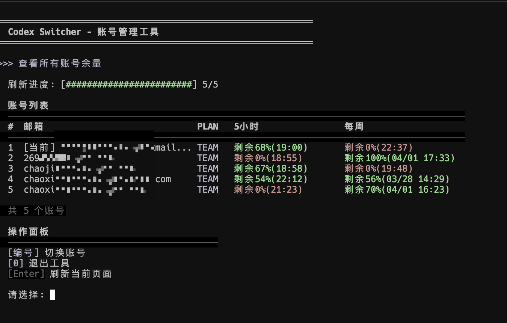

# CJFCodexSwitcher

多个 Codex 账号快速切换与余量查看工具

[English](./README.md)

[](https://github.com/mileson/CJFCodexSwitcher/releases)
[](./LICENSE)
[](./pyproject.toml)
[](https://github.com/mileson/homebrew-cjfcodexswitcher)
[](https://github.com/mileson/CJFCodexSwitcher/stargazers)
[](https://github.com/mileson/CJFCodexSwitcher/commits/main)
[](https://github.com/mileson/CJFCodexSwitcher/releases)



## 功能亮点

- 实时查看所有账号的 5 小时 / 每周余量与下次重置时间
- 启动后直接进入账号列表页面，无需先进入主菜单
- 当前账号用 `[当前]` 标记，并固定显示在最前，同时与其他账号空一行区分
- 切换成功后自动刷新页面
- 多个账号并发实时刷新，减少等待时间
- 支持在余量页直接调用官方 `codex login` 添加新账号，并自动归档到切换器
- 提供 Agent 友好的非交互 CLI：`--list`、`--json`、`--best`、`--switch`、`--save-current`
- 项目内置专用 Skill，方便 Agent 按统一规则操作

## 技术栈

| 层级 | 技术 |
|------|------|
| Runtime | Python 3 |
| Network | Python 标准库 `urllib` |
| Packaging | `pyproject.toml` + `setuptools` |
| UI | Terminal TUI |

## 一句话安装

```bash
brew tap mileson/cjfcodexswitcher && brew install cjfcodexswitcher
```

```bash
pipx install git+https://github.com/mileson/CJFCodexSwitcher.git
```

如果不用 `pipx`，也可以直接安装：

```bash
python3 -m pip install "git+https://github.com/mileson/CJFCodexSwitcher.git"
```

## 新手安装教程

前置要求：

- Python 3.8+
- 本机可用 `codex` 命令

从源码安装：

```bash
git clone https://github.com/mileson/CJFCodexSwitcher.git
cd CJFCodexSwitcher
python3 install.py
source ~/.zshrc  # 或 ~/.bashrc
codex-switcher
```

## 使用说明

工具启动后会直接进入“查看所有账号余量”页面，并显示统一账号列表。

页面中的核心字段：

- `邮箱`：账号邮箱
- `PLAN`：计划类型，例如 `TEAM`
- `5小时`：当前 5 小时额度剩余数量与下次重置时间
- `每周`：当前每周额度剩余数量与下次重置时间
- `[当前]`：当前正在使用的账号，并固定显示在最前

底部操作：

- `Enter`：刷新当前页面
- 输入 `a`：调用官方 `codex login` 添加账号，登录成功后自动归档并保持当前账号
- 输入 `#` 序号：切换到对应账号
- 输入 `0`：退出工具

说明：

- 当前账号如果尚未存档，进入查看余量页时会自动创建存档
- 添加账号复用官方浏览器登录流程；如果处于远程 / 无头环境，可手动使用 `codex login --device-auth`

## Agent / CLI 快捷命令

```bash
codex-switcher --list
codex-switcher --list --json
codex-switcher --best
codex-switcher --best --json
codex-switcher --switch 2
codex-switcher --switch user@example.com
codex-switcher --switch best
codex-switcher --switch best --json
codex-switcher --save-current
codex-switcher --refresh
```

排序规则：

1. 先按 5 小时剩余数量降序
2. 相同则按 1 周剩余数量降序
3. 最后按邮箱升序作为 tie-breaker

## 给 Agent 的可复制提示词

```text
请帮我安装并配置 CJFCodexSwitcher，然后使用项目内 Skill `/Users/mileson/codex-switcher/.codex/skills/codex-switcher-help/SKILL.md` 作为操作规范。优先使用非交互 CLI，不要手动驱动 TUI。步骤要求：
1. 安装或校验 `codex-switcher` 命令可用
2. 运行 `codex-switcher --list --json` 检查账号列表
3. 运行 `codex-switcher --best --json` 判断当前最佳账号
4. 如有需要，运行 `codex-switcher --switch best --json`
5. 最后请你自己验证命令执行通过，并反馈：
   - 验证是否成功
   - 当前最佳账号是谁
   - 如果发生切换，切换到了哪个账号
   - 后续我还可以如何使用这个工具
```

## 项目结构

```text
CJFCodexSwitcher/
├── codex_switcher.py
├── codex-switcher.py
├── install.py
├── pyproject.toml
├── README.md
├── README_CN.md
├── .codex/skills/codex-switcher-help/
└── docs/
```

## 安全说明

更多信息见 [SECURITY.md](./SECURITY.md)

## 贡献方式

更多信息见 [CONTRIBUTING.md](./CONTRIBUTING.md)

## Release

当前推荐版本 release notes：

- [v0.1.6 Release Notes](docs/releases/v0.1.6.md)

## License

MIT
